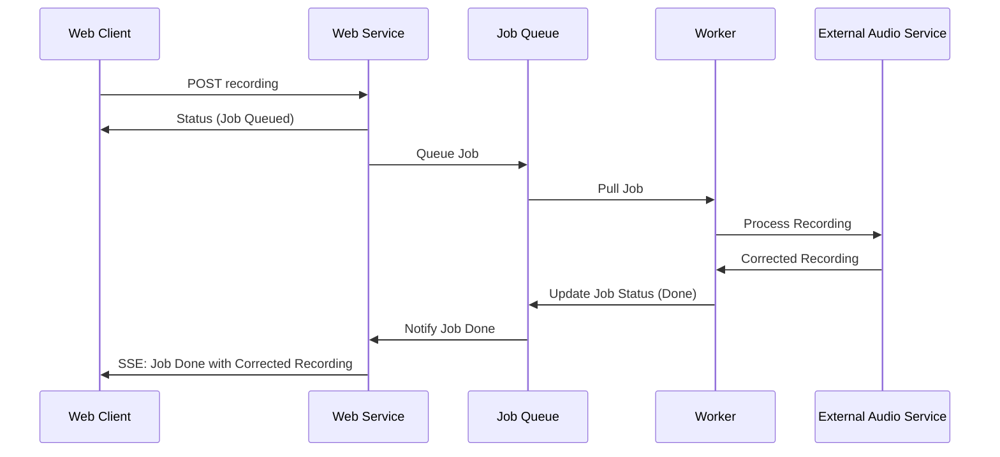

## UML Diagram



## Technology Stack

Using the following technologies:
Next.js for the SPA web client, Express.js for the backend, and RabbitMQ for the job queue. Using TypeScript for the entire project.

## Architecture

- Web Client: The SPA web client that records audio and sends it to the backend.
- Web Node: The backend service that receives the audio recording, queues it for processing, and sends the corrected audio back to the client.
- Job Queue: A RabbitMQ job queue that manages the processing of audio recordings.
- Completion Queue: A RabbitMQ queue that tracks audio correction jobs that have been completed.
- Worker Node: A worker service that processes the audio recordings by sending them to an external audio service for correction.
- Database: A simple SQLite database to store the audio recordings and the associated emails.
- External Audio Service: An external service that corrects the audio recordings and sends back the corrected audio.

## Workplan

The project involves creating a simple SPA with very basic design and functionality. The SPA will have a record button to record audio and a play button to play the recorded audio. The recorded audio will be sent to the backend service, which will queue it for processing. The backend service will then send the audio to the worker service, which will send it to the external audio service for correction. Once the audio is corrected, it will be sent back to the client for playback.

I'll focus on the backend service and the worker service, as they are the core components of the system. I'll create a simple Express.js server app for the backend web node and a worker node that pulls from the job queue for new audio recordings. I'll also create a simple RabbitMQ job queue to manage the processing of audio recordings.

The backend service will have two endpoints: one to receive the audio recording and queue it for processing, and another to notify the client when the audio is corrected. The worker service will listen to the job queue for new audio recordings, process them, and send them to the external audio service for correction.

The external audio service will be simulated as a simple REST API that receives the audio recording, corrects it, and sends back the corrected audio. The worker service will then send the corrected audio back to the backend service, which will notify the client.

## Storage

We'll use a simple SQLite database to store the audio recordings and the associated emails. The database will have a table with the following columns: id, recording, user_email. This way, the server can store the audio recordings and the emails associated with them and quickly respond back to the web app without blocking the main thread.

### Recordings Model

```
pk: id STRING
------
recording BLOB
user_email TEXT
```

## Queues:

The idea is to be able to offload the workload of the main web server to a worker node. To achieve this, we will use queues as a communication channel between the web server and the worker node.

- Job Queue: Tracks audio correction jobs to be processed.
- Completion Queue: Tracks audio correction jobs that have been completed.

### Job Queue

The message only needs the ID of the recording to be processed. The worker node will pull the recording from the database using the ID and handle audio correction. The message will be a JSON object with the following structure:

```typescript
const message = JSON.stringify({
  id: recording.id,
  user_email: recording.user_email,
  timestamp: new Date().toISOString(),
});
```

### Completion Queue
The message will be a JSON object with the following structure:

```typescript
const completionMessage = JSON.stringify({
  id,
  user_email,
  status: "completed",
  timestamp: new Date().toISOString(),
});
```


## TBD
Backend:
- Implement SSE endpoint in the web node.
- Implement mechanisms for the web node to pull completion messages from the queue.
- Integration tests for the backend service.
  
Frontend:
- Implement SSE for the web client to receive notifications when the audio is corrected.
- Implement mechanisms for the web client to query processed recordings.
- Improve the UI/UX for the web client.
- Add input validation for the email field.
